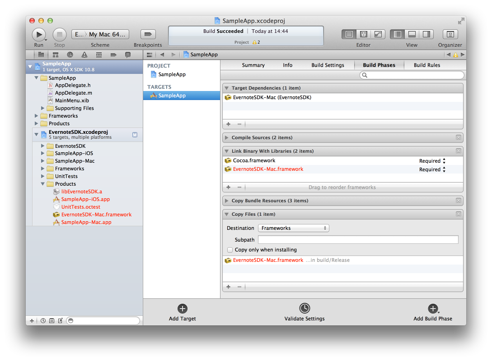

# Evernote Mac SDK

How to use the Evernote SDK in your own Mac project.

## Step by Step

1. Download the Evernote SDK from github
2. Drag the EvernoteSDK Xcode project into your own project
3. Add the `EvernoteSDK-mac.framework`
4. Add `EvernoteSDK-Mac` to the `Target dependencies`
5. Add a `Copy files` build phase and choose destination `Frameworks` from the pull down menu, then add the `EvernoteSDK-mac.framework` to the list

## Coding

1. Use Evernote SDK in your source by adding `#import <EvernoteSDK-Mac/EvernoteSDK.h>`
2. Setup shared Evernote session object
3. Find a sweet spot for authentication
4. Use Evernote API

